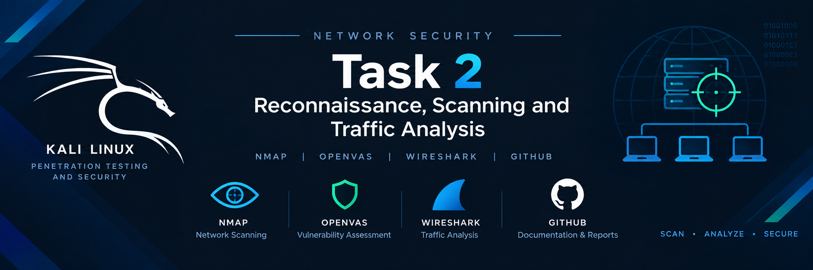
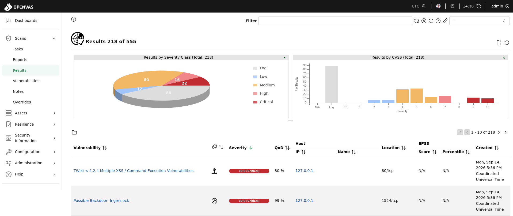

# 🔐 Cybersecurity Internship — Task 2
<p align="center">
  
</p>


Network Security Scanning, Vulnerability Assessment & Traffic Analysis

## Internship Task: Task 2
- Focus: Reconnaissance, Network Scanning, Vulnerability Assessment & Network Traffic Analysis
- Target: Metasploitable 2
- Analysis Machine: Kali Linux
- Tools: Nmap · OpenVAS/GVM · Wireshark

## Overview
This project was completed as part of my cybersecurity internship and focuses on practical network security assessment and traffic analysis.
The assessment was performed in an isolated virtual laboratory environment using Kali Linux as the security-analysis machine and Metasploitable 2 as the intentionally vulnerable target.
The task was divided into three major activities:

- Network Reconnaissance & Scanning using Nmap
- Vulnerability Assessment using OpenVAS/GVM
- Network Traffic Analysis using Wireshark

The objective was to identify exposed network services, assess potential vulnerabilities, and analyze how different network protocols communicate.

## Objectives
The primary objectives of this task were:
* Perform reconnaissance against a controlled laboratory target.
* Identify open TCP ports and running services.
* Perform service and version detection.
* Identify the target operating system.
* Perform vulnerability scanning using OpenVAS/GVM.
* Analyze discovered vulnerabilities and their severity.
* Capture and analyze network traffic using Wireshark.
* Examine ICMP, TCP, HTTP, FTP, and DNS traffic.
* Document security observations and potential mitigations.
* Develop practical skills in network security assessment.

## Lab Environment
| Component | Details |
| :--- | :--- |
| Analysis Machine | Kali Linux |
| Target Machine | Metasploitable 2 |
| Target IP | 10.0.2.4 |
| Virtualization | VirtualBox |
| Network Type | VirtualBox Host-Only / NAT Network |
| Kali IP | 10.0.2.15 |
| Network Interface | eth0 |
| Nmap Version | 7.94 |
| OpenVAS/GVM Version | 22.4.0 |
| Wireshark Version | 4.2.2 |

⚠️ Note: All security testing described in this repository was performed against an intentionally vulnerable virtual machine within a controlled laboratory environment.

```
🗂️ Project Structure
Task-2-Network-Security-Scanning/
│
├── README.md
│
├── Nmap/
│   ├── nmap_scan.txt
│   └── Nmap_Report.pdf
│
├── OpenVAS/
│   └── OpenVAS_Report.pdf
│
├── Wireshark/
│   ├── 01_ICMP/
│   │   ├── icmp_capture.pcapng
│   │   └── icmp_analysis.png
│   │
│   ├── 02_TCP/
│   │   ├── tcp_handshake.pcapng
│   │   └── tcp_handshake.png
│   │
│   ├── 03_HTTP/
│   │   ├── http_capture.pcapng
│   │   └── http_analysis.png
│   │
│   ├── 04_FTP/
│   │   ├── ftp_capture.pcapng
│   │   └── ftp_analysis.png
│   │
│   ├── 05_DNS/
│   │   ├── dns_capture.pcapng
│   │   └── dns_analysis.png
│   │
│   └── Wireshark_Traffic_Analysis_Report.pdf
│
└── Screenshots/
    ├── nmap/
    ├── openvas/
    └── wireshark/
```

### 1. Nmap — Network Reconnaissance & Scanning
1.1 Objective
Nmap was used to perform network reconnaissance against the Metasploitable 2 target to identify open ports, running services, versions, OS information, and potential attack surfaces.

1.2 Target
Target IP: 10.0.2.4

1.3 Scan Command
```bash
nmap -sS -sV -O 10.0.2.4 -oN nmap_scan.txt

```

| Option | Purpose |
| --- | --- |
| `-sS` | TCP SYN scan |
| `-sV` | Service/version detection |
| `-O` | Operating-system detection |
| `-oN` | Save results in normal text format |

1.4 Discovered Services

| Port | Protocol | Service | Version |
| --- | --- | --- | --- |
| 21 | TCP | FTP | vsftpd 2.3.4 |
| 22 | TCP | SSH | OpenSSH 4.7p1 |
| 23 | TCP | Telnet | Linux telnetd |
| 25 | TCP | SMTP | Postfix smtpd |
| 53 | TCP | DNS | ISC BIND 9.4.2 |
| 80 | TCP | HTTP | Apache httpd 2.2.8 |
| 139 | TCP | NetBIOS-ssn | Samba smbd 3.X - 4.X |
| 445 | TCP | Microsoft-DS | Samba smbd 3.0.20 |

*Additional discovered services:* Port 3306 (MySQL 5.0.51a), Port 5432 (PostgreSQL DB), Port 8180 (Apache Tomcat/Coyote JSP engine).

1.5 OS Detection
Nmap identified the target operating system as approximately:
`Linux Kernel 2.6.X (Ubuntu 8.04 LTS)`

1.6 Nmap Observations

* The target exposes a remarkably high number of legacy and unconfigured network services.
* Multiple plaintext authentication protocols (Telnet on port 23, FTP on port 21) are active.
* Database ports (MySQL, PostgreSQL) are exposed directly to the network interface.
* The presence of numerous outdated daemons significantly expands the attack surface.

1.7 Nmap Evidence
*Nmap Scan Output*
`[INSERT NMAP SCREENSHOT HERE]`
*Figure 1: Nmap scan results showing discovered ports and services.*

📄 Nmap Report: `Nmap/Nmap_Report.pdf`
📄 Raw Scan Output: `Nmap/nmap_scan.txt`

---

### 2. OpenVAS/GVM — Vulnerability Assessment
2.1 Objective
OpenVAS/GVM was used to perform an automated vulnerability assessment to uncover known weaknesses associated with the software stack running on Metasploitable 2.

2.2 Scan Configuration

| Parameter | Value |
| --- | --- |
| Target | 10.0.2.4 |
| Scanner | OpenVAS |
| Vulnerability Manager | GVM |
| Scan Type | Full and Fast System Discovery |
| Scan Date | 2026-09-17 |

2.3 Scan Summary
Total Vulnerabilities: **85**

* **Critical:** 7
* **High:** 14
* **Medium:** 22
* **Low:** 30
* **Log / Informational:** 12

2.4 Major Vulnerability Findings

| Vulnerability / Finding | Severity | Affected Service | Port | CVE / Reference |
| --- | --- | --- | --- | --- |
| vsftpd 2.3.4 Backdoor | Critical | FTP | 21/tcp | CVE-2011-2523 |
| Samba usermap script RCE | Critical | SMB | 445/tcp | CVE-2007-2447 |
| DistCC Daemon Command Execution | Critical | DistCC | 3632/tcp | CVE-2004-2687 |
| Apache Tomcat Default Credentials | High | HTTP-Tomcat | 8180/tcp | CVE-2009-3843 |
| Unencrypted Telnet Service | High | Telnet | 23/tcp | N/A |

2.5 Detailed Findings

* **Finding 1 — vsftpd 2.3.4 Backdoor**
* **Severity:** Critical
* **Affected Service:** FTP / Port 21
* **Description:** A malicious backdoor was covertly introduced into the vsftpd 2.3.4 archive download. When a smiley face (`:)`) is sent as the username, the application opens a shell on port 6200.
* **Potential Impact:** Complete remote code execution (RCE) and root-level compromise of the target machine.
* **Recommended Mitigation:** Upgrade vsftpd to a secure, patched version or replace it with an updated SFTP/SCP solution.


* **Finding 2 — Samba usermap script Command Execution**
* **Severity:** Critical
* **Affected Service:** SMB / Port 445
* **Description:** Samba versions 3.0.20 through 3.0.25rc3 contain a vulnerability in the `username map script` parameter, allowing shell injection via specially crafted usernames.
* **Potential Impact:** Remote attackers can execute arbitrary shell commands with root privileges.
* **Recommended Mitigation:** Update Samba to version 3.0.28 or later, or remove the vulnerable `username map script` line from `smb.conf`.


2.6 OpenVAS Evidence
*OpenVAS Scan Results*
<p align="center">
  
</p>
*Figure 2: OpenVAS/GVM vulnerability assessment results.*

📄 OpenVAS Report: `OpenVAS/OpenVAS_Report.pdf`

---

### 3. Wireshark — Network Traffic Analysis
3.1 Objective
Wireshark was utilized to intercept and dissect protocol interactions between Kali Linux and Metasploitable 2 across ICMP, TCP, HTTP, FTP, and DNS.

3.2 ICMP Analysis

* **Traffic Generation:** `ping -c 4 10.0.2.4`
* **Wireshark Filter:** `icmp`
* **Observation:** Verified bidirectional connectivity through ICMP Echo Request (Type 8) and Echo Reply (Type 0) frames.
* **Packet Details:** Source IP: `10.0.2.15` | Destination IP: `10.0.2.4` | Request Packet: `1` | Reply Packet: `2` | ICMP Type: `0 / 8`

3.3 TCP Three-Way Handshake

* **Traffic Generation:** Initialized via `curl http://10.0.2.4`
* **Wireshark Filter:** `tcp.flags.syn == 1`
* **Observation:** Confirmed standard connection establishment: SYN $\rightarrow$ SYN-ACK $\rightarrow$ ACK.
* **Packet Details:** SYN Packet: `12` | SYN Source: `10.0.2.15:45822` | SYN Destination: `10.0.2.4:80` | SYN-ACK Packet: `13` | ACK Packet: `15`

3.4 HTTP Analysis

* **Traffic Generation:** `curl http://10.0.2.4`
* **Wireshark Filter:** `http`
* **Observation:** Captured cleartext request headers and responses traversing port 80.
* **Request Details:** HTTP Method: `GET` | Request URI: `/` | Source IP: `10.0.2.15` | Destination IP: `10.0.2.4` | Destination Port: `80`
* **Security Observation:** Unencrypted cleartext transmission permits passive eavesdropping of sensitive web traffic.

3.5 FTP Analysis

* **Traffic Generation:** `ftp 10.0.2.4` session interaction.
* **Wireshark Filter:** `ftp`
* **Observed Commands:** `USER`, `PASS`, `SYST`, `PWD`, `LIST`, `QUIT`
* **FTP Details:** Server IP: `10.0.2.4` | Server Port: `21` | Client IP: `10.0.2.15`
* **Security Observation:** Credentials (usernames and passwords) are transmitted in plaintext over the control channel, exposing them to credential-sniffing attacks.

3.6 DNS Analysis

* **Traffic Generation:** `nslookup example.com`
* **Wireshark Filter:** `dns`
* **DNS Details:** Queried Domain: `example.com` | DNS Server: `10.0.2.2` | Query Type: `A` | Query Packet: `24` | Response Packet: `25`

---

### 4. Overall Findings

| Tool | Purpose | Key Result |
| --- | --- | --- |
| **Nmap** | Network reconnaissance | Discovered 15+ open ports and legacy application versions. |
| **OpenVAS** | Vulnerability assessment | Flagged 7 critical vulnerabilities including backdoors and RCE flaws. |
| **Wireshark** | Traffic analysis | Confirmed unencrypted transmission of plaintext protocols (FTP, HTTP). |

---

### 5. Security Observations

* **Exposed Services:** Unnecessary network services expand the total attack surface.
* **Vulnerable Services:** Obsolete daemons contain public exploits leading to remote code execution.
* **Unencrypted Protocols:** Legacy protocols lack transport-layer encryption, risking credential exposure.

### 6. Recommended Security Improvements

* Disable unnecessary network services and close unused ports.
* Establish regular patching schedules for OS and applications.
* Migrate web traffic from HTTP to HTTPS (TLS).
* Replace unsecured file transfers (FTP/Telnet) with SFTP and SSH.
* Implement strict host and network firewall rules.

### 7. Reports & Evidence

* Nmap Report: `Nmap/Nmap_Report.pdf`
* OpenVAS Report: `OpenVAS/OpenVAS_Report.pdf`
* Wireshark Report: `Wireshark/Wireshark_Traffic_Analysis_Report.pdf`

### 8. Demonstration Video

* **Video Link:** `[INSERT VIDEO LINK HERE]`

### 9. Screenshots

* Screenshots are located in the respective `Screenshots/` directories for Nmap, OpenVAS, and Wireshark.

### 10. Learning Outcomes
Gained practical proficiency in network scanning, service enumeration, vulnerability scanning via OpenVAS, packet inspection using Wireshark filters, and technical documentation.

⚠️ Disclaimer
Performed strictly within an isolated laboratory environment against Metasploitable 2 for educational purposes.

👤 Author
Maaz Abbasi

Cybersecurity Intern / Student

GitHub: https://github.com/A-maaz

LinkedIn: [YOUR LINKEDIN PROFILE]
