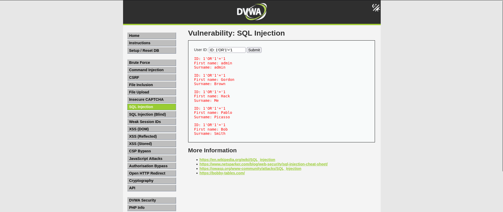
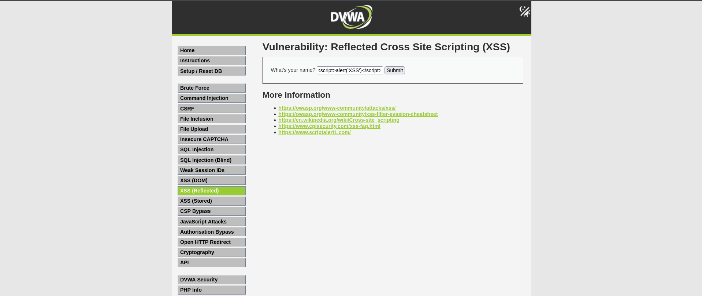
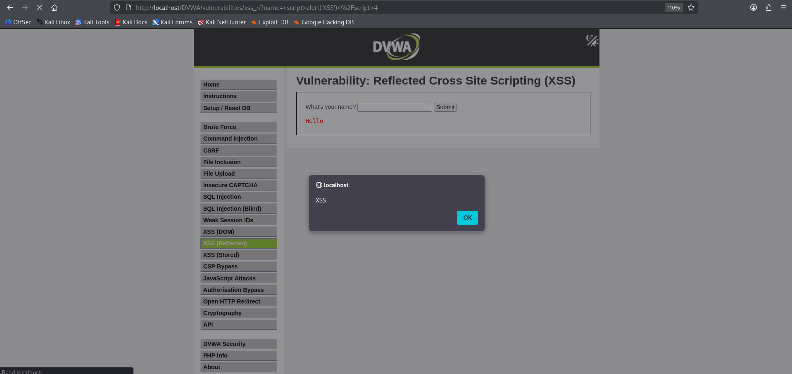
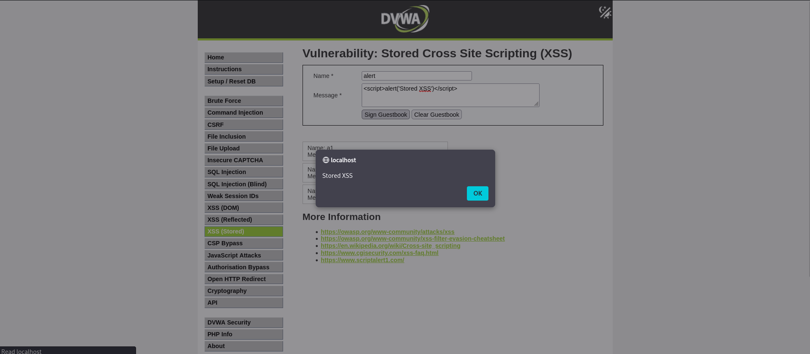
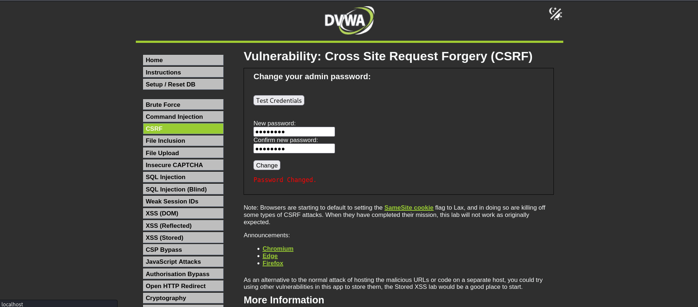
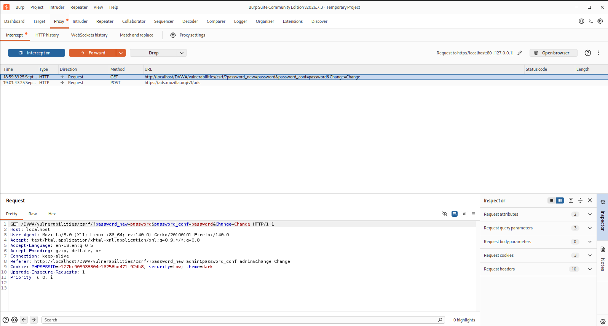

<div align="center">

# 🔐 WEB APPLICATION SECURITY

### APEX Planet Cybersecurity Internship — Task 3

**Identifying • Exploiting • Understanding • Mitigating**

<br>


<br>

**Timeline:** Days 25–36
**Environment:** Kali Linux + DVWA
**Focus:** Web Application Security & Vulnerability Assessment

</div>

---

<div align="center">


</div>

---

# 🧭 Assessment Overview

Task 3 focused on the practical identification and analysis of common **web application security vulnerabilities** using **DVWA (Damn Vulnerable Web Application)** in a controlled laboratory environment.

The assessment covered vulnerability discovery, controlled exploitation, HTTP request manipulation, and defensive techniques.

### 🔎 Assessment Methodology

```text
        ┌─────────────────────┐
        │   Recon / Setup     │
        └──────────┬──────────┘
                   ↓
        ┌─────────────────────┐
        │ Vulnerability       │
        │ Identification      │
        └──────────┬──────────┘
                   ↓
        ┌─────────────────────┐
        │ Controlled          │
        │ Exploitation        │
        └──────────┬──────────┘
                   ↓
        ┌─────────────────────┐
        │ Impact Analysis     │
        └──────────┬──────────┘
                   ↓
        ┌─────────────────────┐
        │ Mitigation &        │
        │ Security Controls   │
        └─────────────────────┘
```

---

# 🧪 Lab Environment

| Component            | Configuration                   |
| :------------------- | :------------------------------ |
| 💻 Attacker / Tester | Kali Linux                      |
| 🎯 Web Target        | DVWA                            |
| 🌐 Web Server        | Apache                          |
| 🗄️ Database         | MySQL / MariaDB                 |
| 🕵️ Proxy            | Burp Suite                      |
| 🌎 Browser           | Firefox                         |
| 🛡️ Assessment       | OWASP-focused testing           |
| 🔒 Network           | Isolated laboratory environment |

---

# ⚡ Vulnerability Assessment Matrix

| Vulnerability         | Category              | Demonstration | Mitigation                  |
| :-------------------- | :-------------------- | :-----------: | :-------------------------- |
| 💉 SQL Injection      | Injection             |       ✅       | Prepared Statements         |
| 🕸️ Reflected XSS     | XSS                   |       ✅       | Output Encoding / CSP       |
| 💾 Stored XSS         | XSS                   |       ✅       | Input Validation / Encoding |
| 🔄 CSRF               | Broken Access Control |       ✅       | Anti-CSRF Tokens            |
| 📂 LFI                | File Inclusion        |       ✅       | Path Validation             |
| 🌐 RFI                | File Inclusion        |       ✅       | Disable Remote Inclusion    |
| 🕵️ HTTP Interception | Traffic Analysis      |       ✅       | Secure Request Handling     |
| 🎯 Intruder Testing   | Automated Testing     |       ✅       | Rate Limiting / Controls    |
| 🛡️ Security Headers  | Hardening             |       ✅       | HTTP Security Headers       |

---

# 🖥️ Lab Architecture

```text
                    ┌──────────────────┐
                    │    Kali Linux    │
                    │                  │
                    │  Firefox         │
                    │  Burp Suite      │
                    │  Security Tools  │
                    └────────┬─────────┘
                             │
                             │ HTTP
                             ▼
                    ┌──────────────────┐
                    │       DVWA       │
                    │                  │
                    │ Apache + PHP     │
                    │ MySQL / MariaDB  │
                    └────────┬─────────┘
                             │
                             ▼
                    ┌──────────────────┐
                    │   Application    │
                    │     Database     │
                    └──────────────────┘
```

---

# 🎬 Practical Demonstration

<div align="center">


### 🔴 Vulnerability Testing → 🔎 Analysis → 🛡️ Mitigation

</div>

> **Tip:** Replace `assets/task-3-demo.gif` with a short 5–10 second GIF showing your Burp Suite/DVWA workflow.

---

# 💉 01 — SQL Injection

### Objective

Demonstrate how improper handling of user-controlled input can manipulate SQL queries and expose unauthorized database information.

### Attack Concept

```text
User Input
     │
     ▼
Application
     │
     ▼
Unsafe SQL Query
     │
     ▼
Database
     │
     ▼
Unexpected / Unauthorized Results
```

### Controlled Test

```text
1' OR '1'='1
```

### Evidence

<div align="center">



</div>

### 🛡️ Mitigation

Use **prepared statements / parameterized queries**.

```php
$stmt = $pdo->prepare(
    "SELECT * FROM users WHERE id = ?"
);

$stmt->execute([$user_input]);
```

### Security Principle

> Treat user-controlled input as **data**, never executable SQL syntax.

---

# 🕸️ 02 — Cross-Site Scripting

XSS was tested in two forms:

```text
┌───────────────────────┐
│ Reflected XSS         │
│ Request → Response    │
└───────────────────────┘

┌───────────────────────┐
│ Stored XSS            │
│ Input → Storage → UI  │
└───────────────────────┘
```

---

## 🔹 Reflected XSS

Controlled proof-of-concept:

```html
<script>alert('XSS')</script>
```

### Evidence

<div align="center">


  

</div>

### Flow

```text
Malicious Input
      ↓
Web Application
      ↓
HTTP Response
      ↓
Browser
      ↓
JavaScript Execution
```

---

## 🔹 Stored XSS

Controlled payload:

```html
<script>alert('Stored XSS')</script>
```

### Evidence

<div align="center">



</div>

### Flow

```text
Input
  ↓
Application
  ↓
Database / Storage
  ↓
Stored Payload
  ↓
User Loads Page
  ↓
JavaScript Execution
```

---

## 🛡️ XSS Mitigation

### Input Validation

Validate input according to the application's expected format.

### Output Encoding

```php
htmlspecialchars(
    $user_input,
    ENT_QUOTES,
    'UTF-8'
);
```

### Content Security Policy

```http
Content-Security-Policy: default-src 'self';
```

> CSP should be treated as an additional security layer rather than a replacement for proper output encoding and input handling.

---

# 🔄 03 — Cross-Site Request Forgery

### Objective

Demonstrate how an authenticated user's browser can be manipulated into sending an unwanted request.

### Attack Flow

```text
Authenticated User
        │
        ▼
Malicious Page
        │
        ▼
Forged Request
        │
        ▼
DVWA
        │
        ▼
Unauthorized Action
```

### Evidence

<div align="center">


  

</div>

---

## 🛡️ Token-Based Protection

A secure form can include a unique CSRF token:

```html
<input
    type="hidden"
    name="csrf_token"
    value="RANDOM_TOKEN"
>
```

The server validates the token against the user's session.

| Request       |   Result   |
| :------------ | :--------: |
| No token      | ❌ Rejected |
| Invalid token | ❌ Rejected |
| Valid token   | ✅ Accepted |

---

# 📂 04 — File Inclusion

The lab included controlled testing of:

* Local File Inclusion
* Remote File Inclusion

---

## 🔹 Local File Inclusion

Example laboratory request:

```text
page.php?file=../../../../etc/passwd
```

### Attack Flow

```text
User-Controlled Path
        ↓
Application
        ↓
Path Processing
        ↓
Unintended Local File
        ↓
Server Response
```

### Evidence

<div align="center">


</div>

---

## 🔹 Remote File Inclusion

Controlled lab resource:

```text
page.php?file=http://LAB-SERVER/test.txt
```

The remote resource was hosted within the authorized laboratory environment.

### Evidence

<div align="center">


</div>

### 🛡️ Mitigation

* Use file allowlists
* Validate and normalize paths
* Avoid direct user-controlled file inclusion
* Disable unnecessary remote inclusion
* Apply least-privilege filesystem permissions
* Separate uploaded content from executable content

---

# 🕵️ 05 — Burp Suite

Burp Suite was used to inspect and manipulate HTTP requests between the browser and DVWA.

### Proxy Architecture

```text
┌──────────┐
│ Firefox  │
└────┬─────┘
     │
     ▼
┌──────────────┐
│ Burp Proxy   │
│              │
│ Intercept    │
│ Inspect      │
│ Modify       │
└────┬─────────┘
     │
     ▼
┌──────────────┐
│     DVWA     │
└──────────────┘
```

---

## 🔹 Request Interception

A DVWA authentication request was intercepted and inspected.

Example structure:

```http
POST /login.php HTTP/1.1
Host: dvwa

username=admin&password=password
```

### Evidence

<div align="center">


   

</div>

---

# 🎯 06 — Burp Intruder

Intruder was used for controlled automated parameter testing against DVWA.

### Workflow

```text
HTTP Request
     ↓
Parameter Selection
     ↓
Intruder
     ↓
Payload Configuration
     ↓
Automated Requests
     ↓
Response Comparison
```

Example test payloads:

```text
test
admin
password
letmein
dvwa
```

### Evidence

<div align="center">


</div>

---

# 🛡️ 07 — HTTP Security Headers

Security headers were analyzed to understand browser-side security controls.

### Headers Reviewed

| Header                      | Security Purpose                 |
| :-------------------------- | :------------------------------- |
| `Content-Security-Policy`   | Restricts content/script sources |
| `X-Content-Type-Options`    | Prevents MIME sniffing           |
| `Referrer-Policy`           | Controls referrer information    |
| `Strict-Transport-Security` | Enforces HTTPS                   |
| `Permissions-Policy`        | Controls browser capabilities    |

---

## 🔎 SecurityHeaders Analysis

A test site was analyzed using SecurityHeaders.com.

### Evidence

<div align="center">


</div>

---

# ⚙️ Apache Hardening

The Apache headers module was enabled:

```bash
sudo a2enmod headers
```

Apache was restarted:

```bash
sudo systemctl restart apache2
```

Example configuration:

```apache
Header always set X-Content-Type-Options "nosniff"

Header always set Referrer-Policy \
"strict-origin-when-cross-origin"

Header always set Content-Security-Policy \
"default-src 'self'"
```

Verification:

```bash
curl -I http://localhost
```

### Evidence

<div align="center">


</div>

---

# 📊 Security Assessment Summary

|  #  | Vulnerability / Control |   Testing   | Mitigation               |
| :-: | :---------------------- | :---------: | :----------------------- |
|  01 | 💉 SQL Injection        | ✅ Completed | Prepared Statements      |
|  02 | 🕸️ Reflected XSS       | ✅ Completed | Output Encoding          |
|  03 | 💾 Stored XSS           | ✅ Completed | Encoding + Validation    |
|  04 | 🔄 CSRF                 | ✅ Completed | CSRF Tokens              |
|  05 | 📂 LFI                  | ✅ Completed | Path Validation          |
|  06 | 🌐 RFI                  | ✅ Completed | Disable Remote Inclusion |
|  07 | 🕵️ Burp Proxy          | ✅ Completed | Secure Request Handling  |
|  08 | 🎯 Intruder             | ✅ Completed | Rate Limiting            |
|  09 | 🛡️ Security Headers    | ✅ Completed | HTTP Hardening           |

---

# 🧠 Key Takeaways

This task provided practical exposure to:

* Web application vulnerability identification
* SQL Injection concepts
* Reflected and Stored XSS
* CSRF attack mechanics
* File Inclusion vulnerabilities
* HTTP request interception
* Burp Suite Proxy
* Burp Suite Intruder
* Security header analysis
* Apache security configuration
* Secure coding practices
* Vulnerability mitigation

### 🔐 Core Security Model

```text
        FIND
         ↓
      ANALYZE
         ↓
      TEST
         ↓
      VERIFY
         ↓
     MITIGATE
         ↓
      RE-TEST
```

---

# 🧰 Tools & Technologies

<div align="center">


</div>

---

# 📸 Evidence Repository

All practical screenshots are organized according to the vulnerability or security control tested.

```text
SQL-Injection/screenshots/
XSS/screenshots/
CSRF/screenshots/
File-Inclusion/screenshots/
Burp-Suite/screenshots/
Security-Headers/screenshots/
```

---

# 🎥 Task 3 Demo

<div align="center">

### ▶️ Web Application Security — Practical Demonstration

[](YOUR_VIDEO_LINK)

</div>

The demonstration covers:

```text
DVWA Setup
     ↓
SQL Injection
     ↓
XSS
     ↓
CSRF
     ↓
File Inclusion
     ↓
Burp Suite
     ↓
Security Headers
     ↓
Mitigation
```

---

# 📄 Technical Report

The detailed assessment report contains:

* Lab configuration
* Testing methodology
* Vulnerability demonstrations
* Screenshots
* Observations
* Security impact
* Mitigation techniques
* Final assessment

<div align="center">

[📑 **View Technical Report**](reports/Task-3-Web-Application-Security-Report.pdf)

</div>

---

# 📚 Internship Progress

<div align="center">

|  Task  | Focus                                 |    Status   |
| :----: | :------------------------------------ | :---------: |
| **01** | 🧪 Cybersecurity Lab Setup            | ✅ Completed |
| **02** | 🔎 Recon, Scanning & Traffic Analysis | ✅ Completed |
| **03** | 🌐 Web Application Security           | ✅ Completed |
| **04** | 🔜 Next Cybersecurity Task            |  ⏳ Upcoming |

</div>

---

# 🔗 Previous Tasks

### 🧪 Task 1 — Cybersecurity Lab Setup

Kali Linux + Metasploitable 2 + VirtualBox isolated laboratory.

**[→ View Task 1](../Task-1-Lab-Setup/)**

### 🔎 Task 2 — Reconnaissance & Network Traffic Analysis

Nmap + OpenVAS + Wireshark practical assessment.

**[→ View Task 2](../Task-2-Network-Security/)**

---

# ⚠️ Ethical & Legal Disclaimer

This project was conducted strictly for **educational and cybersecurity training purposes**.

All testing was performed against intentionally vulnerable applications in a controlled and authorized laboratory environment.

The techniques demonstrated in this repository should only be used against systems for which explicit authorization has been obtained.

---

# 👨‍💻 Author

<div align="center">

### Maaz Abbasi

**Cybersecurity Student | Security Labs | Web Application Security**

[🌐 Portfolio](https://maaz-9786.github.io/maaz.github.io/index.html) •
[💻 GitHub](https://github.com/maaz-9786) •
[🔗 LinkedIn](https://www.linkedin.com/)

<br>

**Building practical cybersecurity skills through hands-on labs, security testing, and defensive implementation.**

<br>

⭐ **If you found this project useful, consider starring the repository.**

</div>

---

<div align="center">

### 🔐 Learn • Test • Secure

`Cybersecurity Internship — Task 3`

</div>
